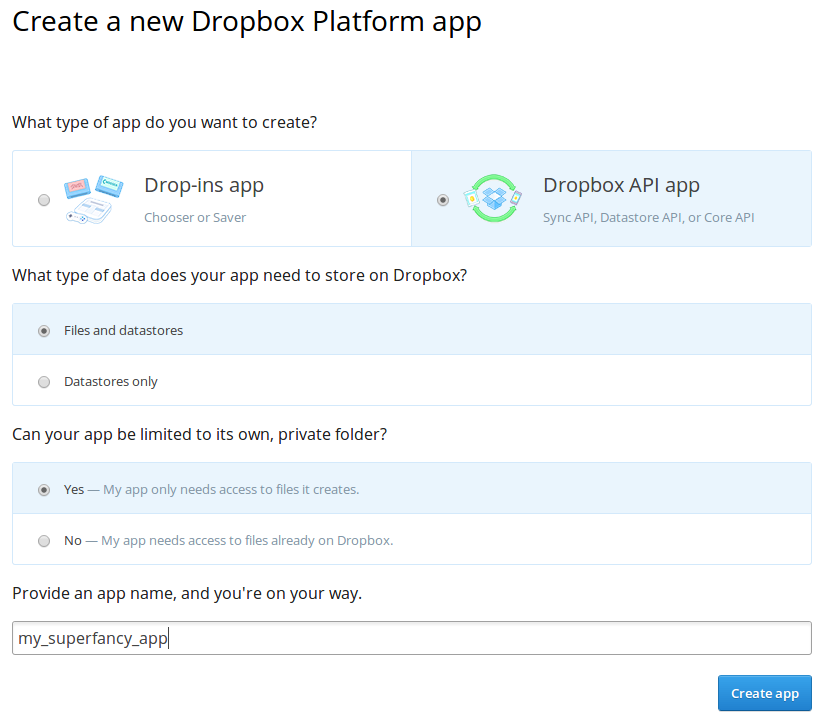

dropbox_synchronization
=======================

This TYPO3 extensions synchronizes a Dropbox app folder with a TYPO3 installation.

What does it do?
~~~~~~~~~~~~~~~~

The extension synchronizes *files* of a specific app folder.
**Short: the files of a single folder**

What does it not do?
~~~~~~~~~~~~~~~~~~~~

It does not synchronize *multiple* folder or *folders within the app folder*.

Getting started
~~~~~~~~~~~~~~~

Download and Install
--------------------

Download the extension from `TYPO3 Extension Repository`_ and install it. Or install directly from within the TYPO3 extension manager.
The extension key is *dropbox_synchronization*.

Create a Dropbox app
--------------------

First, `register a new app at Dropbox`_ and note the app key and secret.
It should be a *Dropbox API app* with *Files and datastores* and you probably want to limit it to its own private folder:

:scale: 50%
    :alt: Dropbox app creation

        This app will be used to access the files of a Dropbox account.

Authorize the App
-----------------

Next, you have to authorize the newly created app to access your Dropbox files.
Therefore create a new TYPO3 page and add a new root template with the following TypoScript setup content (also see file github.com/dArignac/dropbox_synchronization/blob/master/Configuration/TypoScript/api_authorization.txt):

::

    # Workflow:
    # - create a new page
    # - add a new root template to the page, with the TypoScript below in the setup part
    # - open the page, follow instructions (https://yourdomain.com/index.php?id=<PID>&type=123456789)
    # - disable/delete the new page
    page = PAGE
    page {
	      typeNum = 123456789
        config {
            no_cache = 1
            disableAllHeaderCode = 1
        }
        headerData >
        123456789 = USER_INT
        123456789 {
            userFunc = Tx_DropboxSynchronization_UserFunction_AuthorizationCallback->respond
            dropbox_api {
                key = APP_KEY
                secret = APP_SECRET
            }
        }
    }

Afterwards open the page (https://yourdomain.com/index.php?id=<PID>&type=123456789) and click the Dropbox link. Dropbox asks you to authorize the app, accept it and note the authorization code.
Set this code to the TypoScript setup of the newly created page and reload the page:

::

    page {
	      typeNum = 123456789
        ...
        123456789 = USER_INT
        123456789 {
            ...
            dropbox_api {
                key = APP_KEY
                secret = APP_SECRET
                authorizationCode = AUTHORIZATION_CODE
            }
        }
    }

Then refresh the page and copy the TypoScript setup code marked in green into your default page TypoScript setup (not the setup of the newly created page):

::

    plugin.tx_dropboxsynchronization.settings.accessToken = ACCESS_TOKEN

What did just happen? The extension called Dropbox with the authorization code and the app credentials. Dropbox then created an access token. This token will be used to authenticate all calls of the TYPO3 extension to Dropbox.

**Important:** You have to be quick with settings the *authorizationCode* and reloading the page, the code is valid for about 5 minutes!

Now delete or disable the authorization page you just created.

Synchronizing the files
-----------------------

First, insert the TypoScript setup as include in your page template and/or configure your TypoScript with the values below.

::

    plugin.tx_dropboxsynchronization {
        settings {
            # access token of dropbox
            accessToken = ACCESS_TOKEN
            # the folder to synchronize
            syncFolder = fileadmin/user_upload/dropbox
            # specify the master: "typo3", "dropbox" or "none"
            master = none
        }
    }

Then add a new scheduled task in TYPO3 backend (needs system extension *scheduler* to be installed) with Class *Dropbox Synchronization Task*.
...and you're set up!

Select the master side
----------------------

As seen above, you can specify a "master" that defaults to "none".

The master specifies the side, either TYPO3 or Dropbox, from which the synchronization will be handled.

If you delete a file on the master side, it will be deleted on the other side, too. If you delete a file on the non-master side, it will not be deleted on the master and thus be recreated on the next synchronization.

If you set master to "none", no files will be deleted, the synchronization will try to create all files on both sides.

feupload Integration
~~~~~~~~~~~~~~~~~~~~

The extension supports the integration of the *feupload* extension.

**Important:** if using with *feupload* the Dropbox folder has to be inside the *feupload* folder (e.g. uploads/feupload/dropbox)

To activate the integration, set the following TypoScript:

::

    plugin.tx_dropboxsynchronization {
        settings {
            # access token of dropbox
            accessToken = ACCESS_TOKEN
            # the folder to synchronize
            syncFolder = fileadmin/user_upload/dropbox
            feupload {
                # where feupload files are stored
                storagePid < plugin.tx_feupload.persistence.storagePid
                # initial groups to assign to synchronized files
                initialGroups = 1,2,3
                # the UID of the user who shall be set as owner of the files
                userId = 1
                # visibility of files
                # see feupload: 0 - public, -2 - logged in users, 1 - groups
                visibility = 1
            }
        }
    }

Issues and Contact
~~~~~~~~~~~~~~~~~~

If you find bugs or have questions, please `leave an issue on Github`_.

.. _TYPO3 Extension Repository: http://typo3.org/extensions/repository/view/dropbox_synchronization
.. _register a new app at Dropbox: https://www.dropbox.com/developers/apps/create
.. _leave an issue on Github: https://github.com/dArignac/dropbox_synchronization/issues
